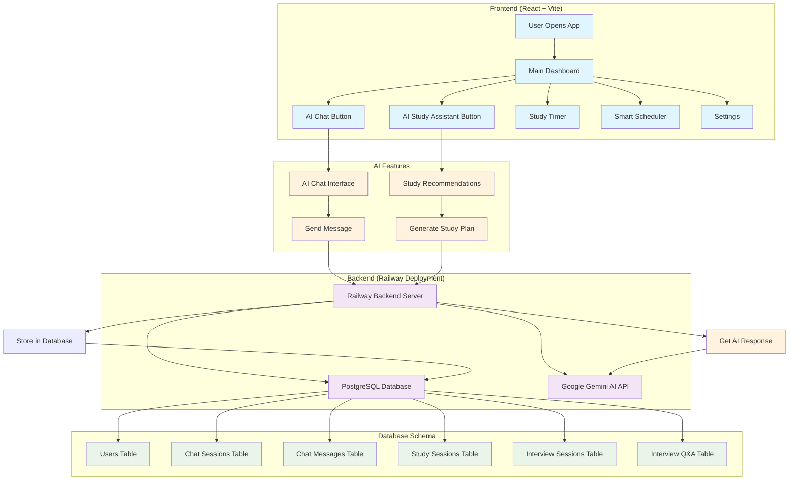
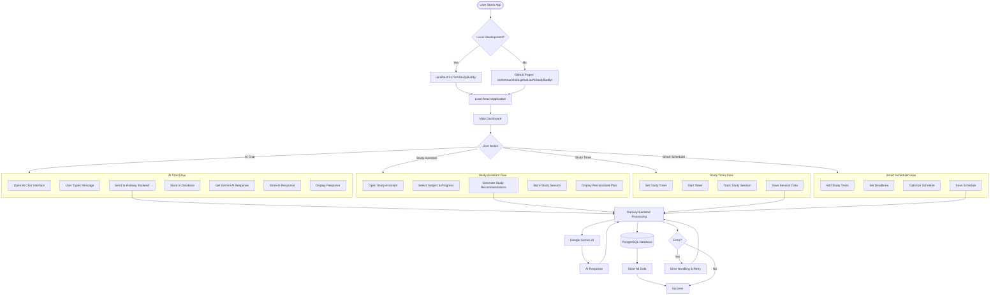
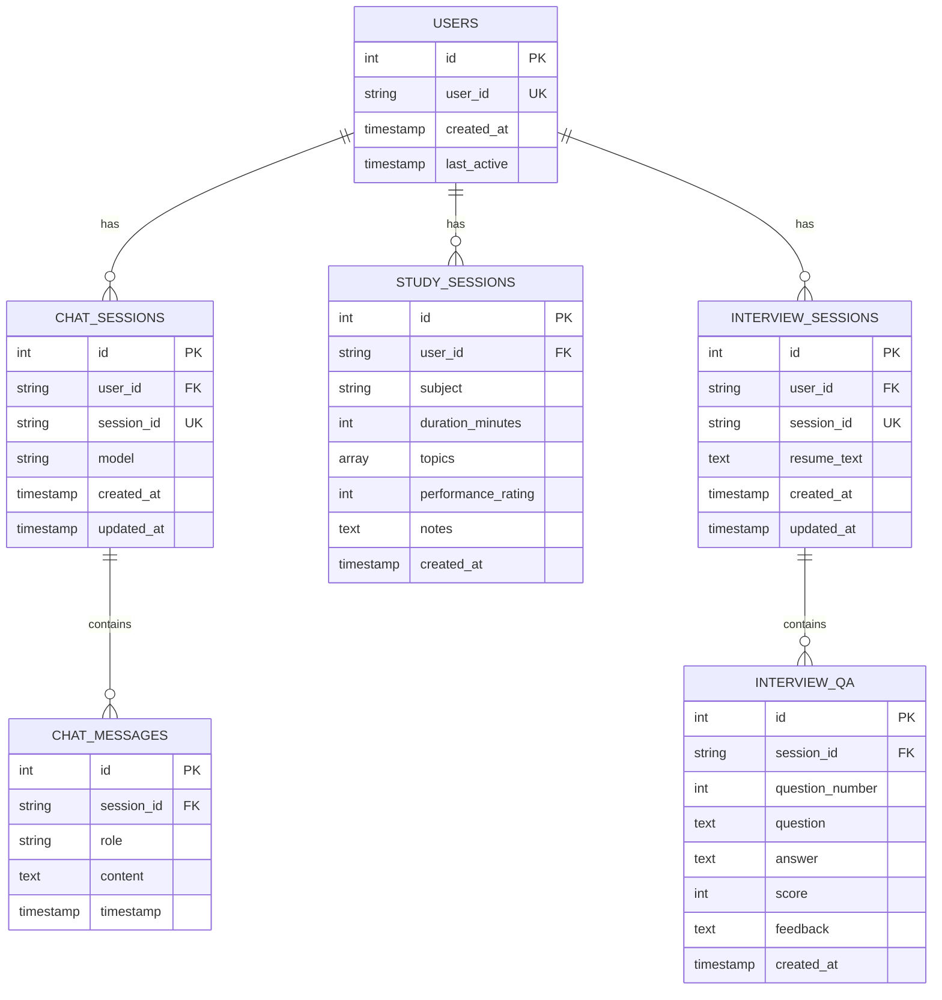
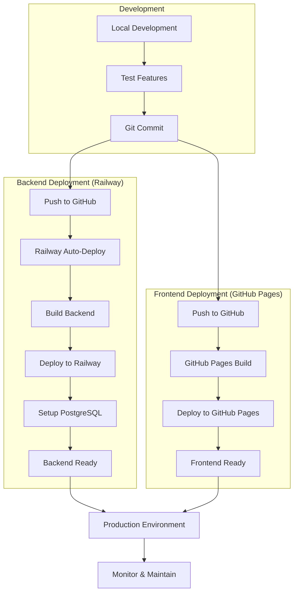
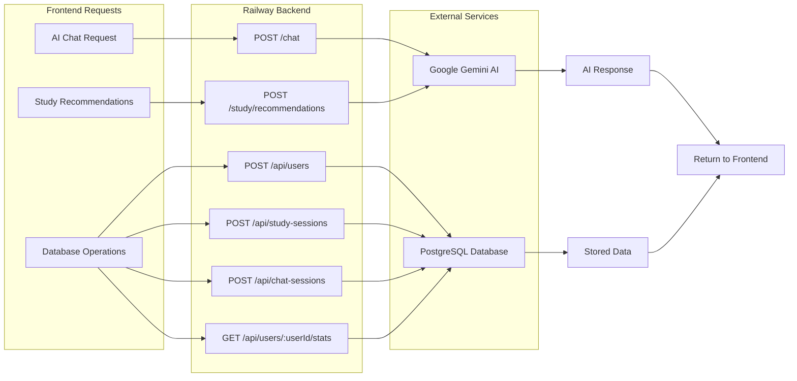

# AI Study Buddy - Complete System Flow Chart

## 🏗️ System Architecture Overview

## 🔄 Detailed User Flow

## 🗄️ Database Schema Flow

## 🚀 Deployment Flow

## 🔧 API Endpoints Flow

## 📊 Data Flow Summary

### **1. User Interaction Flow:**
1. User opens app (localhost:5173 or GitHub Pages)
2. Interacts with AI features (Chat/Study Assistant)
3. Frontend sends requests to Railway backend
4. Backend processes with Google Gemini AI
5. Data stored in PostgreSQL database
6. Response returned to frontend

### **2. Deployment Flow:**
1. Code changes committed to GitHub
2. Railway auto-deploys backend
3. GitHub Pages builds frontend
4. Both services go live automatically

### **3. Database Flow:**
1. All user interactions stored in PostgreSQL
2. Chat sessions, study sessions, interview data
3. Analytics and progress tracking
4. Data persistence across sessions

### **4. AI Integration Flow:**
1. User input sent to Railway backend
2. Backend calls Google Gemini AI API
3. AI processes and responds
4. Response stored in database
5. Response displayed to user

## 🎯 Key Features:

- ✅ **Real-time AI Chat** with database storage
- ✅ **Personalized Study Recommendations**
- ✅ **Study Session Tracking**
- ✅ **Interview Preparation Tools**
- ✅ **Data Analytics & Progress Tracking**
- ✅ **Automatic Deployment** on Railway & GitHub Pages
- ✅ **Scalable PostgreSQL Database**
- ✅ **Production-ready Architecture**
